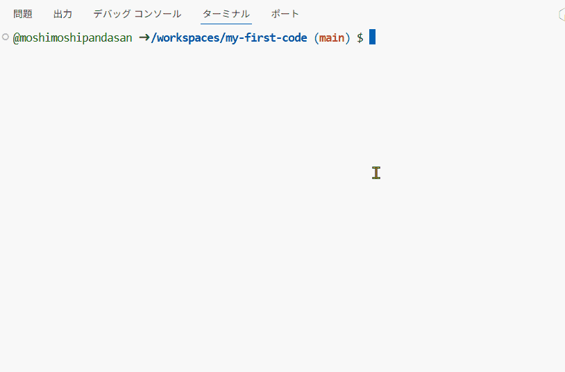
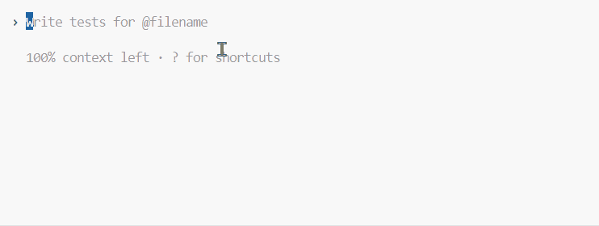
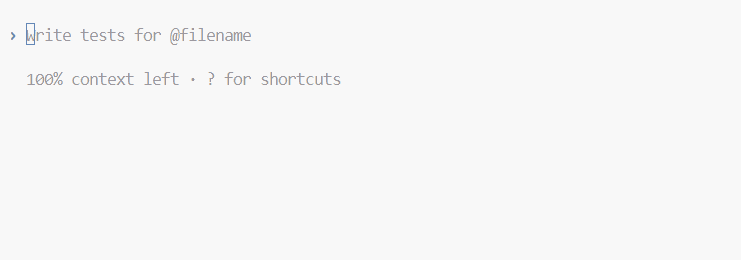

## この章のゴール
Codex CLI の環境設定を完了し、簡単なプログラムを作成します。

## Codex CLI を起動（前回の復習）
通常は`yolo`を使わず起動します（全消し事故を防ぐ）。
Codespaces環境なので全消しでも問題ないのでyoloモードで進めます。
```bash
codex --yolo
```

## Approvals（権限）を設定 /approvals
Codex が自動実行できる操作範囲を絞ります。おすすめは「Auto」。

```text
/approvals
```


- 今回は`Full Access`としますが、通常は`Auto`が安全です。
- `Full Access`では破壊的操作（`rm -rf フォルダ名` 等）が実行できます。※絶対やってはいけません！
- 謎の文字列`0;rgb:3b3b/3b3b/3b3b11;rgb:f8f8/f8f8/f8f8`が時々入りますが、たぶんバグなのでその都度消しましょう。

## Codexのモデルの設定 /model
Codex CLIの入力欄で/modelと入力し、キーボードの Enterキー を押します。
```text
/approvals
```


gpt-5-codex (current) => › Low (current) を選択

## Vibecoding！簡単なプログラムを作成してみよう
ここでは`Issuesにログとして活用するGithub Pagesで公開できる掲示板を作成`してみましょう。

Codes CLIに下記を入力して実行してみましょう

```
GitHub Issues を読み込む埋め込み掲示板を作って。GitHub Pages で公開できて Google Sites に iframe で埋め込める静的 HTML/CSS/JS を生成してほしい。
```

## リモートリポジトリにコミットしてプッシュする
ローカルの変更をリモートへ反映します（Conventional Commits 推奨）。

```bash
# 変更の確認
git status

# すべて追加してコミット
git add -A
git commit -m "docs(article): add part2 env setup and deployment"

# ブランチをリモートへ（例: 現在の作業ブランチ）
git push -u origin docs/article-edit-YYYY-MM-DD
```

Codex CLI を使う場合は、自然言語で指示してもOK。

```text
リモートリポジトリにコミットして、同名ブランチにプッシュして
```

Codex は `git add/commit/push` を提案・実行します（/approvals の設定に従う）。

## GitHub Pagesでデプロイ
静的な HTML/CSS/JS（例: Issues 埋め込み掲示板）を公開する手順です。

ルート直下に `index.html` を置く場合（最短ルート）

1. リポジトリ直下に `index.html` を配置し、`main` にコミット/プッシュ。
2. GitHub → 対象リポジトリ → `Settings` → `Pages` を開く。
3. Build and deployment → `Source: Deploy from a branch` を選択。
4. Branch: `main`、Folder: `/ (root)` を指定して `Save`。
5. 数分後に公開 URL が表示されるのでアクセスして確認。

補足
- プロジェクト Pages の公開 URL は通常 `https://<ユーザー名>.github.io/<リポジトリ名>/`。
- 公開は基本 Public リポジトリで運用（Private は権限に注意）。

### docs/ フォルダで運用する場合
1. ルート直下に `docs/` を作成し、公開したいファイルを配置（例: `docs/index.html`）。
2. GitHub → リポジトリ → Settings → Pages。
3. Build and deployment: 「Branch」を選択 → `main` / `docs` を指定 → Save。
4. 数分後、Pages の URL が発行。アクセスして表示を確認。

GitHub Actions でビルドが必要な場合（例: 生成物を `docs/` に出力する）

```yaml
# .github/workflows/pages.yml（例）
name: Deploy Pages
on: { push: { branches: [ main ] } }
permissions: { contents: read, pages: write, id-token: write }
jobs:
  build:
    runs-on: ubuntu-latest
    steps:
      - uses: actions/checkout@v4
      - name: Build static
        run: |
          mkdir -p docs
          cp -r site/* docs/  # 生成物を docs へ
      - uses: actions/upload-pages-artifact@v3
        with: { path: 'docs' }
  deploy:
    needs: build
    runs-on: ubuntu-latest
    environment: { name: github-pages, url: ${{ steps.deployment.outputs.page_url }} }
    steps:
      - id: deployment
        uses: actions/deploy-pages@v4
```

補足
- Zenn 記事の公開は Zenn 側で行います（`published: true`）。GitHub Pages はデモ/資料公開に活用。
