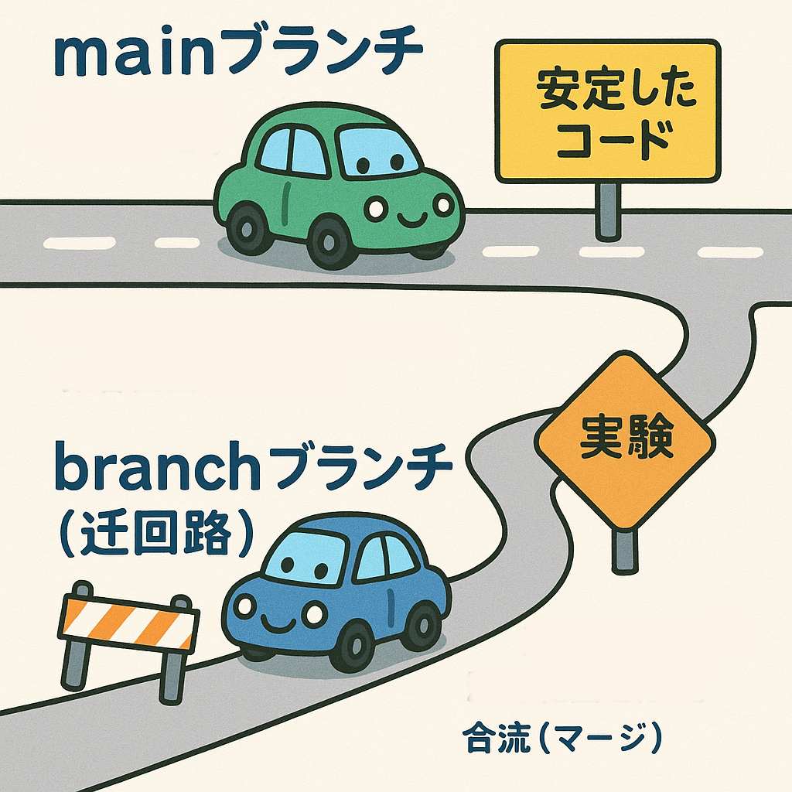

## この章のゴール
前回の掲示板アプリに小さな機能を追加し、「ブランチを切る → 変更 → プルリクエスト（PR） → マージ」までを Codex CLI に自然言語で指示しながら完了できるようになる。

## まずは考え方（なぜブランチ？なぜPR？）
### なぜ main を直接編集しないの？

- 安全に試せる作業用レーンを作るため。main は「公開中の道路」、ブランチは「工事用の迂回路」。
- 途中の失敗や試行錯誤を main に混ぜない。影響範囲を限定できる。
- 並行作業がしやすい。複数人が別ブランチで同時に開発できる。
>
### なぜ PR を作ってからマージするの？
- レビューと記録のため。何を、なぜ、どう直したかが残る。
- 自動テストやプレビュー（CI/CD）を挟める。壊れにくくなる。
- 説明責任と再現性。後から読む人が経緯を理解しやすい。

### 参考：コミットとプッシュのイメージ（前回の続き）
- `git add` は「箱詰め」、`git commit` は「宛名書き＋封」、`git push` は「配送してリモート（GitHub）へ」。

## 今回のシナリオ（掲示板アプリに機能追加）
前回作った掲示板に「キーワード検索」を追加します。小さく始めて、PR で差分をわかりやすくします。

## 前提：Codex CLI の準備
Codex CLI を起動し、権限は通常は `Auto`（推奨）。

```text
/approvals
```

## 手順 1 — ブランチを切る
自然言語で OK。ブランチ名は意味が伝わるものにします。

```text
新機能用のブランチを作って。ブランチ名は「feature/board-search-2025-10-18」。
```

Codex は `git checkout -b feature/board-search-2025-10-18` を提案・実行します（/approvals に従う）。

コツ
- 命名例：`feature/<要約>-<日付>`、`fix/<Issue番号>-<要約>`
- 作業の単位は小さく。1PR＝1目的が読みやすい。

## 手順 2 — 仕様を短く言語化する
実装前に期待する動きを1分で文章化。Codex にもそのまま渡せます。

例（要約仕様）
- 画面上部に検索入力欄を追加
- 入力に応じて Issue タイトル／本文を部分一致で絞り込み
- 件数バッジを表示、0件時は「見つかりませんでした」を表示

## 手順 3 — 自然言語で実装を依頼
前提として、アプリのリポジトリ（前回の掲示板プロジェクト）を開いた状態で実行します。

```text
掲示板に「キーワード検索」機能を追加して。要件は次のとおり：
- 画面上部に検索ボックス（placeholder: "キーワードで検索"）。
- 入力に応じて Issue の一覧をフロントエンドで絞り込み。
- 一致件数をボタン横に表示。0件時はメッセージ表示。
- 既存のスタイルに合わせて、HTML/CSS/JS を最小変更で。
テストと動作確認の手順も README に追記して。
```

Codex は変更候補を提示し、必要ファイルを編集します。差分を確認し、必要なら追加の指示を出します（例：「命名を `q` から `keyword` に変更して」）。

## 手順 4 — 変更をコミットしてプッシュ
```text
変更を確認して、説明付きでコミット・プッシュして。メッセージは「feat: add keyword search to board」。
```

裏側でおこること（イメージ）
- `git add`（梱包）→ `git commit`（宛名＋封）→ `git push`（配送してリモートへ）

## 手順 5 — プルリクエストを作成
```text
このブランチから main へプルリクエストを作って。タイトルは
「feat: board search」。本文には目的、主な変更点、確認手順を書いて。Squash merge を前提にまとめて。
```

PR 本文のテンプレ（例）
```
目的
- 掲示板にキーワード検索を追加し、投稿閲覧の利便性を向上。

主な変更
- 検索入力欄の追加、一覧のクライアントサイド絞り込み
- 件数バッジ、0件メッセージ
- README に使い方と確認手順を追記

確認手順
1. ローカル起動
2. 任意の語句を入力し、一覧が絞り込まれること
3. 0件時のメッセージ表示
```

## 手順 6 — レビュー→修正→再プッシュ
コメントが付いたら、同じブランチに追加コミットしてプッシュします。

```text
レビュー指摘を反映して再コミット・プッシュして。コミットメッセージは「fix: address review comments」。
```

プッシュするたびに PR が自動で更新されます。

## 手順 7 — マージして後片付け
```text
PR を Squash merge でマージして。マージ後にリモートの作業ブランチを削除して。
```

Squash merge を選ぶ理由
- main の履歴が「1PR=1コミット」で読みやすい
- 細かい作業コミットは PR の中に温存される（履歴は失われない）

## よくある質問（初心者向け）
- 直接 main にコミットしてはダメ？
  - 小さな個人検証なら可。ただし共有リポジトリでは事故や衝突の原因。ブランチ＋PR が安全。
- PR を出す相手がいないときは？
  - 自分レビューでも価値あり。差分の見える記録と自動チェックの足場になります。
- コンフリクトが出たら？
  - Codex に「コンフリクトを解消して再コミットして」と依頼。無理なら「どのファイルのどの行が衝突？」と聞くと道筋が明確になります。

## まとめ
- ブランチは安全な作業用レーン、PR は説明可能な変更の入場券、マージで本線（main）に合流。
- Codex CLI には自然言語で十分。小さく速く回し、履歴を読みやすく保つのがコツ。

---

付録：今回の一連の指示例（コピペ可）

```text
新機能用のブランチを作って。ブランチ名は「feature/board-search-2025-10-18」。

掲示板に「キーワード検索」機能を追加して。要件は次のとおり：
- 画面上部に検索ボックス（placeholder: "キーワードで検索"）。
- 入力に応じて Issue の一覧をフロントエンドで絞り込み。
- 一致件数をボタン横に表示。0件時はメッセージ表示。
- 既存スタイルに合わせて最小変更で。README に手順も追記して。

変更を確認して、説明付きでコミット・プッシュして。メッセージは「feat: add keyword search to board」。

このブランチから main へプルリクエストを作って。タイトルは「feat: board search」。本文には目的、主な変更点、確認手順を書いて。Squash merge でマージ予定にして。

レビュー指摘を反映して再コミット・プッシュして。コミットメッセージは「fix: address review comments」。

PR を Squash merge でマージして。マージ後にリモートの作業ブランチを削除して。
```

